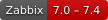
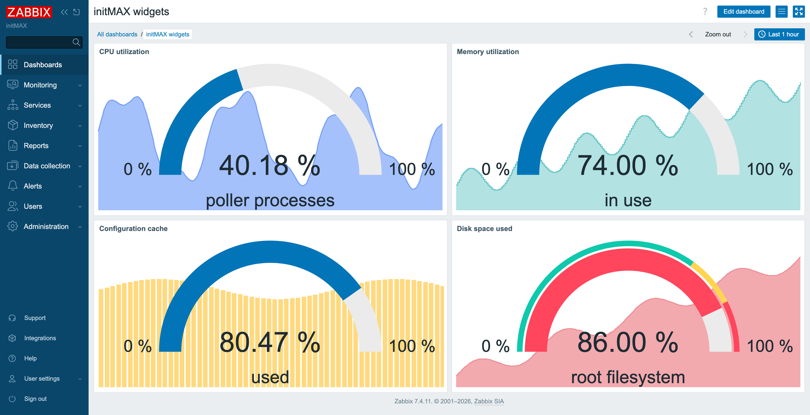
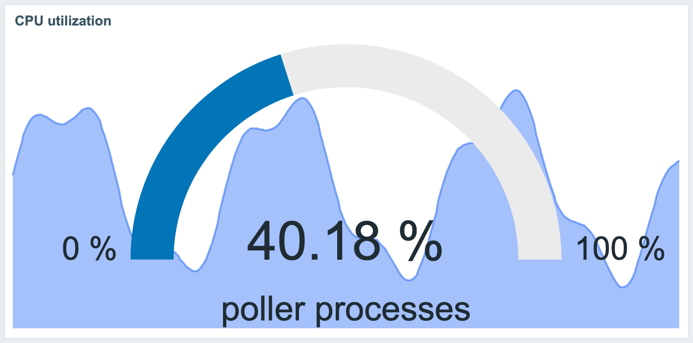
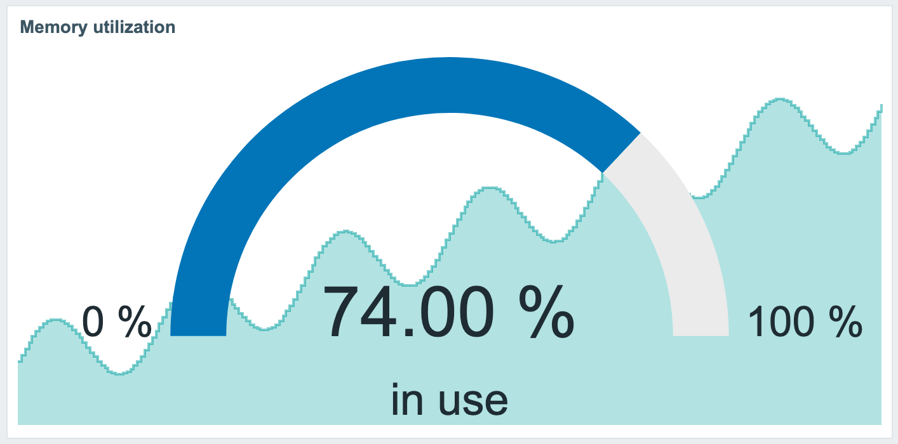
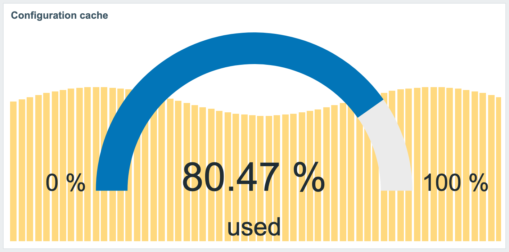
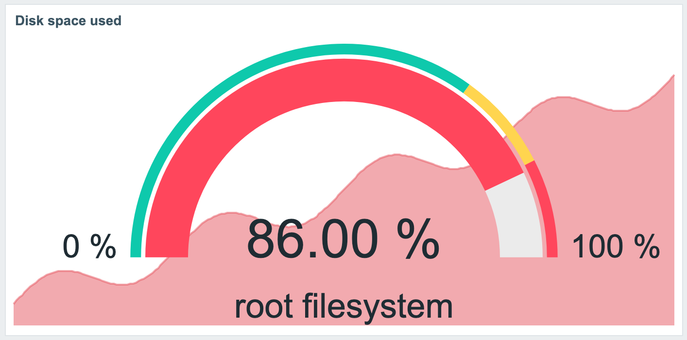
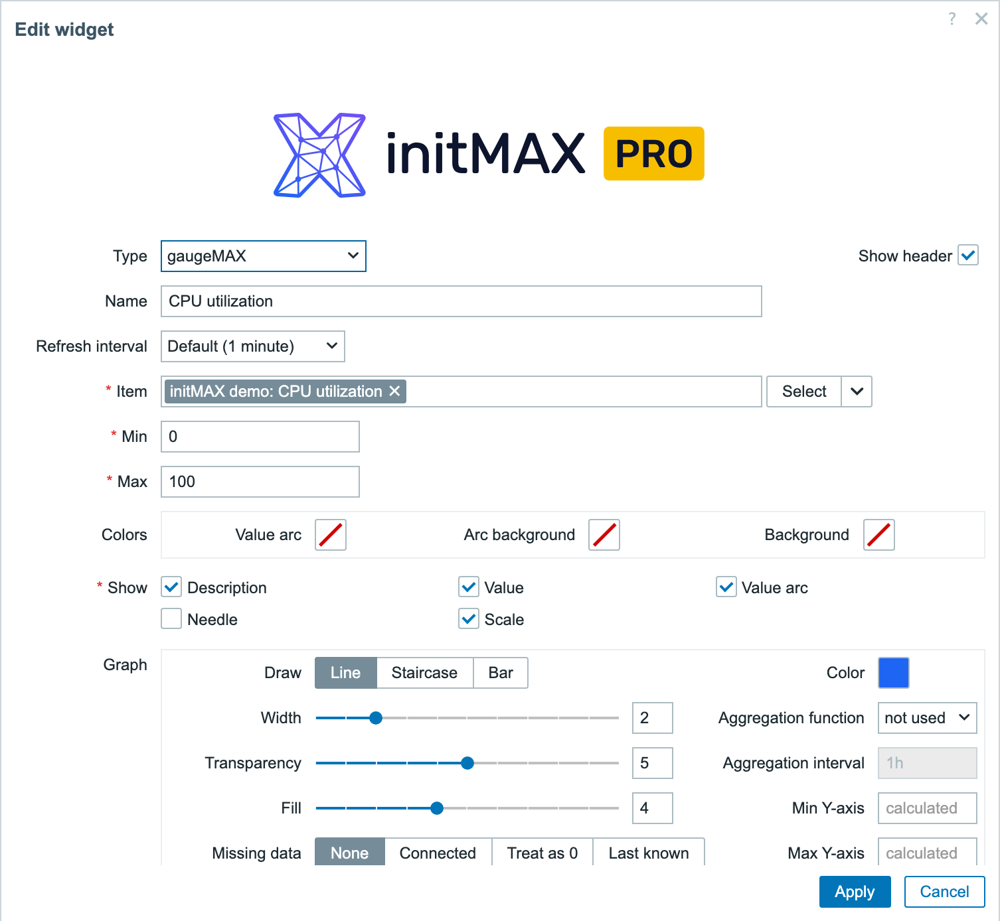

<h1>gaugeMAX</h1>

developed and maintained by

and community

<strong>The Zabbix gauge, with the item's own history drawn behind the dial.</strong> 
A dial tells you where a value sits between its limits. It cannot tell you whether it got there ten seconds ago or has been parked there all afternoon - so gaugeMAX paints the recent history straight behind it.

<a href="#what-you-can-build"><strong>Features</strong></a> &nbsp;·&nbsp;
<a href="#examples"><strong>Examples</strong></a> &nbsp;·&nbsp;
<a href="#install"><strong>Install</strong></a> &nbsp;·&nbsp;
<a href="#free-vs-pro"><strong>FREE vs PRO</strong></a> &nbsp;·&nbsp;
<a href="https://portal.initmax.com"><strong>Portal</strong></a> &nbsp;·&nbsp;
<a href="https://www.initmax.com/wiki/gaugemax/"><strong>Docs</strong></a>

 

---

## Why gaugeMAX

A dial is a good answer to "how full is it" and a poor answer to "should I care". 86% of a disk is routine if it has read 86% all week, and it is a callout if it read 60% this morning. **gaugeMAX** draws the item's own recent history behind the dial, so the tile carries the reading, its limits and its direction at once - and the board that needed a gauge plus a graph now needs one widget.

## What you can build

<table>
<tr>
<td width="50%" valign="top">

**Capacity dials**
Disk, memory and pool usage against a fixed ceiling, with the climb visible behind the needle.

</td>
<td width="50%" valign="top">

**Health tiles**
Threshold colours repaint the arc, so a wall of dials reads green-amber-red from across the room.

</td>
</tr>
<tr>
<td width="50%" valign="top">

**SLA and budget dials**
Min and max fixed to the target, so the dial reads as a percentage of the thing that matters.

</td>
<td width="50%" valign="top">

**Per-host boards**
Follow the dashboard host selector and one board serves every host.

</td>
</tr>
<tr>
<td width="50%" valign="top">

**Styled background graphs** &nbsp;PRO
Line, staircase or bars, in your colour, width, fill and transparency.

</td>
<td width="50%" valign="top">

**Aggregated views** &nbsp;PRO
Average, min, max, sum or count over an interval you choose, on its own time period.

</td>
</tr>
</table>

## Examples

<table>
<tr>
<td width="50%" align="center" valign="top"> <small><b>Utilization</b> - a filled line behind the dial</small></td>
<td width="50%" align="center" valign="top"> <small><b>Memory</b> - staircase for stepped data</small></td>
</tr>
<tr>
<td width="50%" align="center" valign="top"> <small><b>Cache usage</b> - bars for sampled series</small></td>
<td width="50%" align="center" valign="top"> <small><b>Disk</b> - thresholds colour the arc</small></td>
</tr>
</table>

## Configuration

One familiar widget form. Pick the item, set the dial's **min** and **max**, and choose what the tile shows - description, value, units, needle, scale and value arc - plus thresholds and their arc. The background graph is always drawn; PRO adds the controls over how it looks and what data it covers. PRO-only fields stay visible in FREE, greyed with a padlock, so you can see what an upgrade adds before you buy it.

## Install

Both **FREE** and **PRO** ship as **GPG-signed `deb` / `rpm` packages** from the initMAX repository - `apt` / `dnf` installs them and keeps them updated. Same flow for both editions; PRO just adds your personal repo token.

### Easiest way - the guided installer on the Portal

Open the product page, pick your **OS** and **edition**, and copy the ready-made command. FREE is fully public (no login); PRO fills in your token once you sign in. There's a feedback box right there too.

<a href="https://portal.initmax.com/catalog/zabbix-gaugemax#how-to-install"><strong>→ Open the installer on the Portal</strong></a>

Prefer a plain archive? Every release also ships as a **ZIP** - FREE [straight from the repo](https://repo.initmax.com/zabbix/free/zip/gaugemax/), PRO with your repo token - handy for offline or manual installs.

Then enable it in **Administration → General → Modules**. Done.

## FREE vs PRO

| Feature                                                          |  FREE  |  PRO   |
| ---------------------------------------------------------------- | :----: | :----: |
| Gauge dial with min / max, description, value and units          |   ✅   |   ✅   |
| Item history drawn as a background graph                         |   ✅   |   ✅   |
| Needle, scale and value arc                                      |   ✅   |   ✅   |
| Thresholds with colour palette and threshold arc                 |   ✅   |   ✅   |
| One package for Zabbix 6.0 - 7.4                                 |   ✅   |   ✅   |
| Localised into all 25 Zabbix display languages                   |   ✅   |   ✅   |
| High availability ready                                          |   ✅   |   ✅   |
| **Line, staircase and bar draw styles**                          |   ❌   |   ✅   |
| **Graph colour, width, fill and transparency**                   |   ❌   |   ✅   |
| **Aggregation function and interval** (avg · min · max · sum · count · first · last) |   ❌   |   ✅   |
| **Missing-data handling**                                        |   ❌   |   ✅   |
| **Min / max Y-axis and a graph-specific time period**            |   ❌   |   ✅   |
| Licence                                                          | AGPLv3 | [Commercial](./LICENSE-PRO.md) |

The FREE edition still draws the graph - it simply draws it with the built-in presentation. The PRO controls are stripped from the FREE package rather than switched off, so the lock holds on the server, not only in the browser.

## Requirements

|              |                                                              |
| ------------ | ------------------------------------------------------------ |
| **Zabbix**   | 6.0 · 6.2 · 6.4 · 7.0 · 7.2 · 7.4 - one package covers all   |
| **PHP**      | 7.4 or newer                                                 |
| **OS**       | Debian/Ubuntu · RHEL/Rocky/Alma/Oracle/Amazon · SUSE         |
| **Editions** | FREE (public repo) · PRO (token-gated repo)                  |
| **Languages** | All 25 Zabbix display languages - the widget follows each user's own language setting |
| **High availability** | Ready. No server-side component and no local state; install it on every frontend node of an HA cluster and any node can serve it |

Every capability above works on every supported version, including the ones where Zabbix has no gauge of its own - it gained one only in 7.0, so on 6.0, 6.2 and 6.4 gaugeMAX brings the whole dial, its styling and its thresholds itself.

Two differences on 6.0 - 6.4 are worth knowing before you install, and both are limits of those frontends rather than of the widget:

- **The graph's aggregation** (average / min / max over an interval) needs an API that arrived in 7.0, so the graph there draws the raw history. Everything else about it - draw style, colour, width, transparency, fill, missing-data handling, Y-axis bounds and the time window - is fully configurable.
- **The configuration dialog has no collapsible "Advanced configuration" section**, because those frontends have none. The same settings are all there, in the same order; they are simply always visible.

A widget configured on any supported version keeps every setting when Zabbix is upgraded - the stored field names and values are identical across the whole range.

## Support &amp; links

- 📚 **[Documentation / Wiki](https://www.initmax.com/wiki/gaugemax/)**
- 🛒 **[Product page](https://www.initmax.com/product/gaugemax/)**
- 🎫 **[Portal](https://portal.initmax.com)** - downloads, tokens, support tickets
- 💾 **Source code** (FREE, AGPLv3) - included in every package and published as a [source archive](https://repo.initmax.com/zabbix/free/zip/gaugemax/) on repo.initmax.com
- ✉️ **[support@initmax.com](mailto:support@initmax.com)**

---

FREE: <a href="https://www.gnu.org/licenses/agpl-3.0.html">AGPLv3</a> &nbsp;·&nbsp; PRO: <a href="./LICENSE-PRO.md">commercial</a> &nbsp;·&nbsp; © 2021–2026 initMAX s.r.o.

